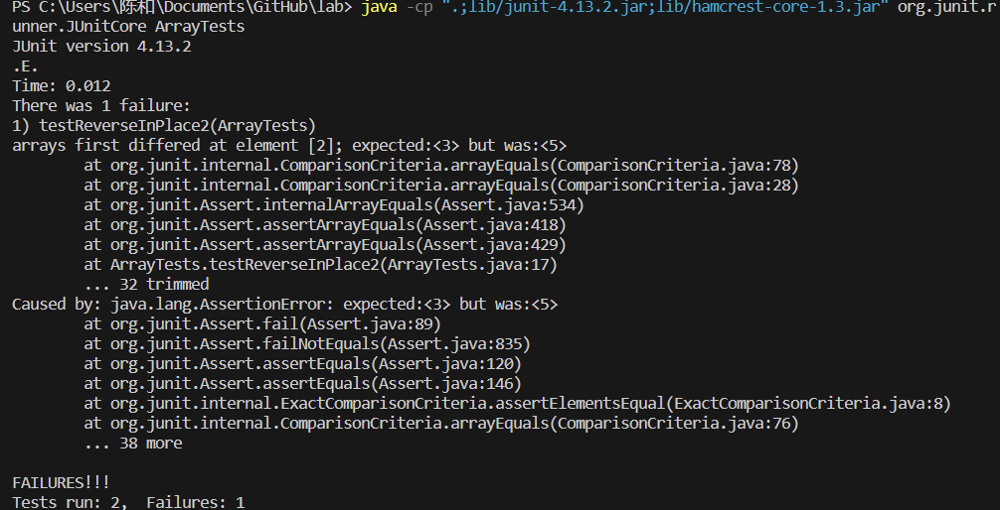

# CSE15L - Lab - Reports
# Lab Report 3 - Bugs and Commands
## Part 1 - Bugs
## A Failure-Input
```java
@Test 
public void testReverseInPlace() {
    int[] input1 = { 5,4,3 };
    ArrayExamples.reverseInPlace(input1);
    assertArrayEquals(new int[]{ 3,4,5 }, input1);
}
```

## An input that doesn't induce a failure
```java
@Test 
public void testReverseInPlace() {
    int[] input1 = { 3 };
    ArrayExamples.reverseInPlace(input1);
    assertArrayEquals(new int[]{ 3 }, input1);
}
```

## Symptom:



## The Bug: 
## Before: 
```java
static void reverseInPlace(int[] arr) {
    for(int i = 0; i < arr.length; i += 1) {
      arr[i] = arr[arr.length - i - 1];
    }
}

```

## After:
```java
static void reverseInPlace(int[] arr) {
    int[] tempArray = new int[arr.length];
    for(int i = 0; i < arr.length; i += 1) {
        tempArray[i] = arr[arr.length - i - 1];
    }
    for(int i = 0; i < arr.length; i += 1) {
    arr[i] = tempArray[i];
    }
}
```
## Brief describe:
I create another array that store the value then assign the reversed value back. Because before
the fix, the same array are being use to store elements, the first element lost when the first `for`
loop is excuted.

# Part 2 - Researching Commands
# -name
# Example1:
* Command: 
`find -name 911report`
* Output
`./911report`
# Example 2:
* Command: 
`find -name preface.txt`
* Output: 
`./911report/preface.txt`

 # This commands are able to find the files and directory, it's useful when you forget the path of the file.

# -size
# Example1:
* Command: 
`find ./911report -size +1k`
* Output:
```java
./911report
./911report/chapter-1.txt
./911report/chapter-10.txt
./911report/chapter-11.txt
./911report/chapter-12.txt
./911report/chapter-13.1.txt
./911report/chapter-13.2.txt
./911report/chapter-13.3.txt
./911report/chapter-13.4.txt
./911report/chapter-13.5.txt
./911report/chapter-2.txt
./911report/chapter-3.txt
./911report/chapter-5.txt
./911report/chapter-6.txt
./911report/chapter-7.txt
./911report/chapter-8.txt
./911report/chapter-9.txt
./911report/preface.txt
```
# Example 2:
* Command: 
`find ./plos/pmed.0020191.txt -size 1k`
* Output: 
`./plos/pmed.0020191.txt`
# This command are able to find the file in that directory based on their size.
# -type
# Example1:
* Command:
`find ./ -type d`
* Output:
```java
./
./911report
./biomed
./government
./government/About_LSC
./government/Alcohol_Problems
./government/Env_Prot_Agen
./government/Gen_Account_Office
./government/Media
./government/Post_Rate_Comm
./plos
```
# Example2:
* Command:
`find ./911report -type f`
* Output:
```java
./911report/chapter-1.txt
./911report/chapter-10.txt
./911report/chapter-11.txt
./911report/chapter-12.txt
./911report/chapter-13.1.txt
./911report/chapter-13.2.txt
./911report/chapter-13.3.txt
./911report/chapter-13.4.txt
./911report/chapter-13.5.txt
./911report/chapter-2.txt
./911report/chapter-3.txt
./911report/chapter-5.txt
./911report/chapter-6.txt
./911report/chapter-7.txt
./911report/chapter-8.txt
./911report/chapter-9.txt
./911report/preface.txt

```
# This command can find every thing that are directory in that directory
